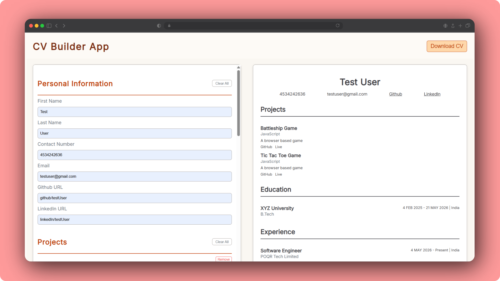

# CV Builder App

A simple and responsive CV Builder built using React. This application allows users to create, edit, preview, and download their resume in real time.

## Live Demo
https://cv-builder-orcin-gamma.vercel.app/

## Features

- Add and edit Personal Information
- Add multiple Education entries
- Add multiple Experience entries
- Add multiple Projects
- Add Skills (comma-separated)
- Real-time CV preview
- Download CV as PDF using browser print
- Responsive design for mobile and desktop

## Tech Stack

- React (Functional Components, Hooks)
- JavaScript (ES6+)
- CSS (Custom styling with responsive design)
- HTML5

## Key Implementation Details

- Reusable components like `Input`, `SectionItem`, `AddButton`, `RemoveButton`, and `ClearButton`
- Controlled form inputs using React state
- Dynamic list handling for sections like education, experience, and projects
- PDF download implemented using browser `window.print()`
- Responsive layout using Flexbox and media queries

## Screenshot

